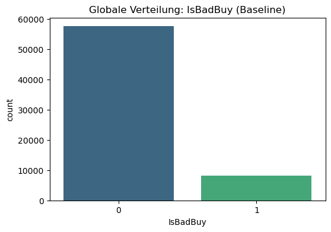
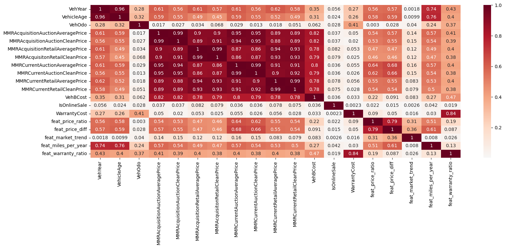
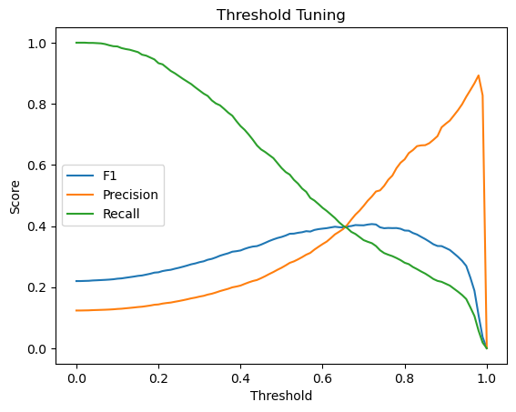
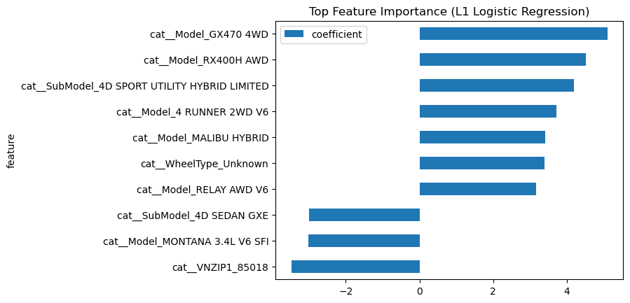

# US Used Vehicle Resales — Bad-Buy Prediction

> A classification model that predicts, **before purchase**, whether a used car bought at
> auction will turn out to be a "Bad Buy" — a lemon that cannot be resold — so a US used-car
> dealer can stop overpaying for vehicles that generate losses instead of margin.


---

## TL;DR

- **Task:** binary classification of `IsBadBuy` on **65,620 auctioned vehicles** with **33 features**.
- **Hard part:** the classes are strongly **imbalanced** — only **12.35 %** of cars are bad buys, so accuracy is meaningless; the project optimizes the **F1 score of the bad-buy class**.
- **Best model:** Random Forest (`class_weight='balanced'`) reaches **bad-buy F1 ≈ 0.39**, up from a **0.29 baseline** (≈ +34 % relative).
- **Strongest signal:** a **missing wheel-type** (`WheelType = Unknown`) is the single most predictive feature for a bad buy — a data-quality flag that doubles as a risk flag.
- **Deliverable:** scored predictions for **7,291 unlabeled vehicles** (`features_aim.csv`).



*Class distribution: ~57,500 good buys vs ~8,100 bad buys — the core modeling challenge.*

---

## Where to start

| You are a… | Start here |
| :--- | :--- |
| Recruiter (30 s) | This README — TL;DR + Results |
| Data Scientist (10 min) | [`00_introduction.ipynb`](notebooks/00_introduction.ipynb) → [`01_exploring.ipynb`](notebooks/01_exploring.ipynb) |
| Modeling deep-dive | [`03a_modelling-logreg.ipynb`](notebooks/03a_modelling-logreg.ipynb) · [`03b_modelling-rf.ipynb`](notebooks/03b_modelling-rf.ipynb) |

---

## Problem Statement

A US used-car dealer buys vehicles cheaply at online auctions to resell them at a margin.
The biggest risk is a **"Bad Buy"** (a lemon): a car with severe defects that cannot be
resold and instead generates follow-up costs (storage, repairs, write-downs).

**Guiding question:** Can we predict before purchase whether an offer is a bad buy —
**without rejecting too many good cars**? This is a precision/recall trade-off on a rare
positive class, not an accuracy problem.

---

## Dataset

| | |
| :--- | :--- |
| Training data | `data/01_raw/data_train.csv` — **65,620 rows**, **33 columns**, `;`-separated, labeled |
| Scoring data | `data/01_raw/features_aim.csv` — **7,291 rows**, unlabeled (prediction target) |
| Target | `IsBadBuy` — `0` good buy (87.65 %), `1` bad buy (12.35 %) |
| Source | StackFuel capstone project (Module 3, Chapter 4) |

Full column reference → [`DATA_DICTIONARY.md`](DATA_DICTIONARY.md).

> Raw data and trained models are excluded from the repo via `.gitignore`.

---

## Approach

**1 · Exploration** ([`01_exploring.ipynb`](notebooks/01_exploring.ipynb)) — distributions,
missing values, and the strong class imbalance; price columns (MMR family) are highly
correlated.



**2 · Preparation** ([`02_processing.ipynb`](notebooks/02_processing.ipynb)) — cleaning,
feature engineering (price ratios, mileage-per-year, risk buckets), and a **stratified**
train/test split to preserve the 12.35 % bad-buy rate.

**3 · Modeling** ([`03a`](notebooks/03a_modelling-logreg.ipynb) ·
[`03b`](notebooks/03b_modelling-rf.ipynb)) — baseline Logistic Regression → L1 Logistic
Regression and Random Forest, all with `class_weight='balanced'` to counter the imbalance.
Decision threshold tuned on the F1 curve:



**4 · Evaluation** ([`04a`](notebooks/04a_evaluation-baseline.ipynb) ·
[`04b`](notebooks/04b_evaluation-logreg.ipynb)) — bad-buy precision/recall/F1 vs. the baseline.

---

## Results

Performance on the **bad-buy class** (the minority class that matters):

| Model | Recall | Precision | F1 | Accuracy |
| :--- | :---: | :---: | :---: | :---: |
| Baseline — Logistic Regression | 0.61 | 0.19 | 0.29 | 0.62 |
| Logistic Regression Lasso (L1, balanced) | 0.59 | 0.26 | 0.36 | 0.74 |
| **Random Forest (balanced)** | 0.52 | 0.31 | **0.39** | 0.80 |

<sub>Baseline & LogReg-Lasso from the held-out test set (n = 13,124; notebooks `04a`/`04b`).
Random Forest from internal validation in model tracking (n = 10,500; notebook `03b`).
Project selection metric: F1 of the bad-buy class.</sub>

**Most predictive features** (consistent across LogReg L1 and Random Forest): a **missing
wheel type** (`WheelType = Unknown`) dominates, followed by specific models/sub-models and
vehicle age.



**Recommendation:** Random Forest with balanced class weights is the strongest candidate.
Because precision on bad buys is still modest (~0.31), deploy the model as a **triage
filter** that flags risky offers for human review, not as an automatic reject — and treat
missing `WheelType` as a first-order risk indicator at intake.

---

## Notebooks

| # | Notebook | Content |
| :--- | :--- | :--- |
| 00 | [`00_introduction.ipynb`](notebooks/00_introduction.ipynb) | Entry point: scenario, task, navigation |
| 01 | [`01_exploring.ipynb`](notebooks/01_exploring.ipynb) | Exploratory data analysis |
| 02 | [`02_processing.ipynb`](notebooks/02_processing.ipynb) | Cleaning, feature engineering, split |
| 03 | [`03_modelling-prep.ipynb`](notebooks/03_modelling-prep.ipynb) | Modeling setup |
| 03a | [`03a_modelling-logreg.ipynb`](notebooks/03a_modelling-logreg.ipynb) | Logistic Regression |
| 03b | [`03b_modelling-rf.ipynb`](notebooks/03b_modelling-rf.ipynb) | Random Forest |
| 04a | [`04a_evaluation-baseline.ipynb`](notebooks/04a_evaluation-baseline.ipynb) | Baseline evaluation |
| 04b | [`04b_evaluation-logreg.ipynb`](notebooks/04b_evaluation-logreg.ipynb) | Final evaluation |

---

## Tech Stack

Python 3.12 · pandas · NumPy · scikit-learn (Logistic Regression, Random Forest,
pipelines, `ColumnTransformer`) · Matplotlib / Seaborn · Jupyter · uv ·
[`wgnd`](https://github.com/kaywiegand/wgnd-toolkit) toolkit for EDA helpers.

Project code lives in the installable package `us_used_vehicle_resales`.

---

## Setup

```bash
uv venv && source .venv/bin/activate
uv pip install -e .            # add ".[dev]" for pytest/ruff/black
```

Then open the notebooks in reading order (start with `00_introduction.ipynb`).

```python
from us_used_vehicle_resales.cleaning import clean_data
from us_used_vehicle_resales.features import engineer_features
import us_used_vehicle_resales as wg     # ModelTracker, print_*, save_*, inspect_*
```

---

## Author

**Kay Wiegand** · [GitHub](https://github.com/kaywiegand)
