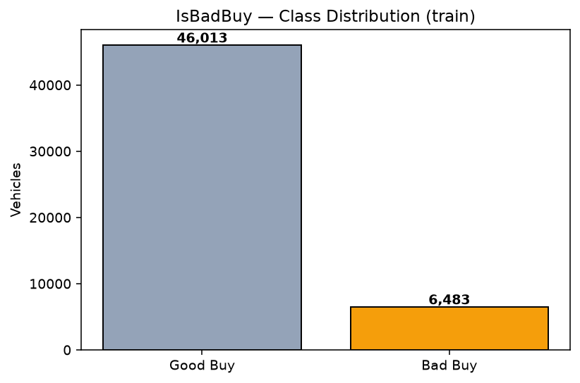

# US Used Vehicle Resales — Bad-Buy Prediction

> A classification model that predicts, **before purchase**, whether a used car bought at
> auction will turn out to be a "Bad Buy" — a lemon that cannot be resold — so a US used-car
> dealer can stop overpaying for vehicles that generate losses instead of margin.


---

## TL;DR

- **Task:** binary classification of `IsBadBuy` on **65,620 auctioned vehicles** with **33 features**.
- **Hard part:** the classes are strongly **imbalanced** — only **12.35 %** of cars are bad buys. A model that always predicts "good buy" would already hit 87.65 % accuracy while catching zero bad buys, so the project optimizes the **F1 score of the bad-buy class** instead.
- **Systematic testing, not hand-picking:** a self-built `ModelTracker` + a feature/model catalog ran **448 logged experiments** across 19 feature sets × 6 model families in ~62 minutes of active compute — see [`05_experiment_framework.ipynb`](notebooks/05_experiment_framework.ipynb).
- **Casting a wide net wins:** a numeric-only feature set (6 features) tops out at **F1 0.29**; the full catalog (28 features, adding categoricals) reaches **F1 0.37** — consistently, across model families.
- **Strongest signal is a near-empty field:** `WheelType` is filled in normally for 95.6 % of cars (unremarkable there), but the 4.4 % where it's simply **missing** have a **70.3 % bad-buy rate** — 6× the base rate, and the single strongest predictor.
- **Best model:** Logistic Regression with L1 penalty (`class_weight='balanced'`) reaches **bad-buy F1 ≈ 0.37** on the held-out test set. Tuning the decision threshold to the triage use case lifts it to **F1 ≈ 0.42 at precision ≈ 0.45**.
- **Error analysis:** the model's blind spot is newer, pricier bad buys that don't carry the `WheelType = Unknown` flag — see [`06_error_analysis.ipynb`](notebooks/06_error_analysis.ipynb).



*Class distribution: ~57,500 good buys vs ~8,100 bad buys — the core modeling challenge.*

---

## Where to start

| You are a… | Start here |
| :--- | :--- |
| Recruiter (30 s) | This README — TL;DR + Results |
| Data Scientist (10 min) | [`00_introduction.ipynb`](notebooks/00_introduction.ipynb) → [`01_exploring.ipynb`](notebooks/01_exploring.ipynb) |
| Modeling deep-dive | [`03a_modelling-logreg.ipynb`](notebooks/03a_modelling-logreg.ipynb) · [`03b_modelling-rf.ipynb`](notebooks/03b_modelling-rf.ipynb) |

---

## Problem Statement

A US used-car dealer buys vehicles cheaply at online auctions to resell them at a margin.
The biggest risk is a **"Bad Buy"** (a lemon): a car with severe defects that cannot be
resold and instead generates follow-up costs (storage, repairs, write-downs).

**Guiding question:** Can we predict before purchase whether an offer is a bad buy —
**without rejecting too many good cars**? This is a precision/recall trade-off on a rare
positive class, not an accuracy problem.

**Objective (assessment bar):** reach **bad-buy F1 > 0.40** on the hidden scoring set
`features_aim.csv`, whose labels are known only to the examiner. The deliverable is the set of
predictions for that file. (Original brief → [`docs/ASSIGNMENT.md`](docs/ASSIGNMENT.md).)

---

## Dataset

| | |
| :--- | :--- |
| Training data | `data/01_raw/data_train.csv` — **65,620 rows**, **33 columns**, `;`-separated, labeled |
| Scoring data | `data/01_raw/features_aim.csv` — **7,292 rows**, unlabeled (prediction target) |
| Target | `IsBadBuy` — `0` good buy (87.65 %), `1` bad buy (12.35 %) |
| Source | StackFuel capstone project (Module 3, Chapter 4) |

Full column reference → [`DATA_DICTIONARY.md`](DATA_DICTIONARY.md) · original brief → [`docs/ASSIGNMENT.md`](docs/ASSIGNMENT.md).

> Raw data and trained models are excluded from the repo via `.gitignore`.

---

## Approach

**1 · Exploration** ([`01_exploring.ipynb`](notebooks/01_exploring.ipynb)) — distributions,
missing values, the strong class imbalance, and a bivariate risk analysis showing that
text-looking columns (Trim, SubModel, VNZIP1, WheelType) are strong risk drivers, not noise;
price columns (MMR family) are highly correlated and get compressed into 3 ratio features.

**2 · Preparation** ([`02_processing.ipynb`](notebooks/02_processing.ipynb)) — cleaning,
feature engineering (price ratios, mileage-per-year, risk buckets), and a **stratified**
train/test split to preserve the 12.35 % bad-buy rate.

**3 · Systematic experimentation** ([`05_experiment_framework.ipynb`](notebooks/05_experiment_framework.ipynb))
— a feature catalog (19 sets) × model catalog (6 families), swept and logged by a self-built
`ModelTracker` (448 runs) instead of hand-picking a feature set upfront.

**4 · Modeling** ([`03a`](notebooks/03a_modelling-logreg.ipynb) ·
[`03b`](notebooks/03b_modelling-rf.ipynb)) — baseline Logistic Regression → L1 Logistic
Regression and Random Forest, all with `class_weight='balanced'` to counter the imbalance.
Decision threshold tuned on the F1 curve.

**5 · Evaluation** ([`04_evaluation.ipynb`](notebooks/04_evaluation.ipynb)) — all three
finalists on the same held-out test set, threshold tuning, scoring.

**6 · Error analysis** ([`06_error_analysis.ipynb`](notebooks/06_error_analysis.ipynb)) — confusion
matrix plus a segment breakdown of the missed and wrongly-flagged cars.

---

## Results

Performance on the **bad-buy class** (the minority class that matters), all three on the
**same held-out test set** (n = 13,124), threshold 0.5:

| Model | Recall | Precision | F1 (bad-buy) | ROC-AUC |
| :--- | :---: | :---: | :---: | :---: |
| Baseline — Logistic Regression (8 feat) | 0.61 | 0.19 | 0.29 | 0.67 |
| Random Forest (deep, balanced) | 0.64 | 0.24 | 0.35 | 0.75 |
| **Logistic Regression Lasso (L1, balanced)** | 0.60 | 0.27 | **0.37** | 0.77 |

<sub>Reproduced end-to-end in [`04_evaluation.ipynb`](notebooks/04_evaluation.ipynb).</sub>

**Casting a wide net beats hand-picking** — across the 448 tracked runs, a numeric-only feature
set (6 features) tops out at F1 0.2918; the full catalog (28 features, adding categoricals) reaches
F1 0.3726, consistently across model families:

| Feature set | Features | Best F1 (tracked runs) |
| :--- | :---: | :---: |
| `numeric` — price, age, odometer only | 6 | 0.2918 |
| **`all_in_with_noise` — full catalog** | **28** | **0.3726** |

**Threshold tuning** — with balanced class weights the default 0.5 threshold over-flags. At the
F1-optimal threshold (0.65) the winning model reaches **F1 0.42 · Precision 0.45 · Recall 0.40**,
balanced for the triage use case: catch bad buys without rejecting too many good cars.

**Most predictive feature: a near-empty field.** `WheelType` is filled in normally for 95.6 % of
cars — unremarkable there — but the 4.4 % where it's simply missing carry a 70.3 % bad-buy rate:

| WheelType value | Share of cars | Bad-buy rate |
| :--- | :---: | :---: |
| Alloy | 49.3 % | 11.1 % |
| Covers | 45.3 % | 8.1 % |
| Special | 1.0 % | 12.6 % |
| **Missing** | **4.4 %** | **70.3 %** |
| Average (all cars) | — | 12.3 % |

**Recommendations:** deploy the **L1 Logistic Regression** at the tuned threshold as a **triage
filter** — it flags ~10 % of an unlabeled batch for human review at ~0.45 precision, not as an
automatic reject. Treat a missing `WheelType` as a first-order risk indicator at intake.

**Opportunities:** add a second, independent risk feature for the model's blind spot — newer,
pricier bad buys that don't carry the `WheelType` flag (see [`06_error_analysis.ipynb`](notebooks/06_error_analysis.ipynb));
and evaluate the leaner 7-feature `cats_strong` set (F1 0.3587 — 96 % of the full catalog's
performance with a quarter of the features).

> **Full write-up:** [`07_results.ipynb`](notebooks/07_results.ipynb) — internal + true-holdout
> numbers, the data-leakage audit, and lessons learned.

---

## Notebooks

| # | Notebook | Content |
| :--- | :--- | :--- |
| 00 | [`00_introduction.ipynb`](notebooks/00_introduction.ipynb) | Entry point: scenario, task, navigation |
| 01 | [`01_exploring.ipynb`](notebooks/01_exploring.ipynb) | Exploratory data analysis |
| 02 | [`02_processing.ipynb`](notebooks/02_processing.ipynb) | Cleaning, feature engineering, split |
| 03 | [`03_modelling-prep.ipynb`](notebooks/03_modelling-prep.ipynb) | Modeling setup |
| 03a | [`03a_modelling-logreg.ipynb`](notebooks/03a_modelling-logreg.ipynb) | Logistic Regression |
| 03b | [`03b_modelling-rf.ipynb`](notebooks/03b_modelling-rf.ipynb) | Random Forest |
| 04 | [`04_evaluation.ipynb`](notebooks/04_evaluation.ipynb) | **Results SSoT** — all models on the same held-out test, threshold tuning, scoring |
| 04a | [`04a_evaluation-baseline.ipynb`](notebooks/04a_evaluation-baseline.ipynb) | Baseline evaluation (exploratory) |
| 04b | [`04b_evaluation-logreg.ipynb`](notebooks/04b_evaluation-logreg.ipynb) | LogReg deployment walk-through (exploratory) |
| 05 | [`05_experiment_framework.ipynb`](notebooks/05_experiment_framework.ipynb) | **Engineering showcase** — feature catalog, model catalog & the self-built `ModelTracker` (448-run sweep) |
| 06 | [`06_error_analysis.ipynb`](notebooks/06_error_analysis.ipynb) | **Error analysis** — confusion matrix, false-negative/false-positive segment breakdown |
| 07 | [`07_results.ipynb`](notebooks/07_results.ipynb) | **Full results & retrospective** — internal + true-holdout numbers, root-cause analysis, lessons learned |

---

## Tech Stack

Python 3.12 · pandas · NumPy · scikit-learn (Logistic Regression, Random Forest,
pipelines, `ColumnTransformer`) · Matplotlib / Seaborn · Jupyter · uv.

All project code and the EDA / experiment helpers live in the installable package
`us_used_vehicle_resales`. That includes a **self-built `ModelTracker`** — a lightweight experiment
logger that records F1 / recall / precision / ROC-AUC per run to CSV, flags the best run, and exports
the fitted pipeline (448 runs across feature sets and model families). These helpers are part of my
own tooling; a shared, standalone version lives in
[`wgnd-toolkit`](https://github.com/kaywiegand/wgnd-toolkit), and consolidating this project onto it
is planned (see workspace backlog).

> **Related work:** shares the project scaffolding and tooling approach with
> [**zh-tram-flow**](https://github.com/kaywiegand/zh-tram-flow) — the portfolio's flagship
> end-to-end data-science project (a Zürich tram-delay prediction pipeline), which already consumes
> the shared `wgnd-toolkit`.

---

## Setup

```bash
uv venv && source .venv/bin/activate
uv pip install -e .            # add ".[dev]" for pytest/ruff/black
```

Then open the notebooks in reading order (start with `00_introduction.ipynb`).

```python
from us_used_vehicle_resales.cleaning import clean_data
from us_used_vehicle_resales.features import engineer_features
import us_used_vehicle_resales as wg     # ModelTracker, print_*, save_*, inspect_*
```

---

## Reports & Artifacts

| Artifact | Path | Content |
| :--- | :--- | :--- |
| Results & retrospective | [`notebooks/07_results.ipynb`](notebooks/07_results.ipynb) | Full results, true-holdout proof, root-cause analysis, lessons learned |
| Error analysis | [`notebooks/06_error_analysis.ipynb`](notebooks/06_error_analysis.ipynb) | Confusion matrix, false-negative/false-positive segment breakdown |
| Project hub | [`public/index.html`](public/index.html) | Self-contained overview: pitch, key charts, results table |
| Data dictionary | [`public/data-dictionary.html`](public/data-dictionary.html) · [`DATA_DICTIONARY.md`](DATA_DICTIONARY.md) | All 33 columns + known issues |
| Charts | [`public/img/`](public/img/) | Target distribution, correlations, feature importance, threshold curve |

## Author

**Kay Wiegand** · [GitHub](https://github.com/kaywiegand) · [LinkedIn](https://www.linkedin.com/in/kaywiegand/)
